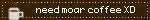
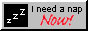
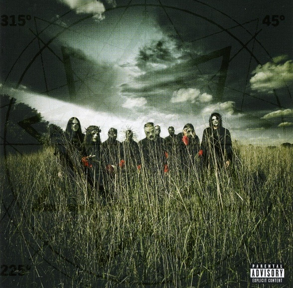
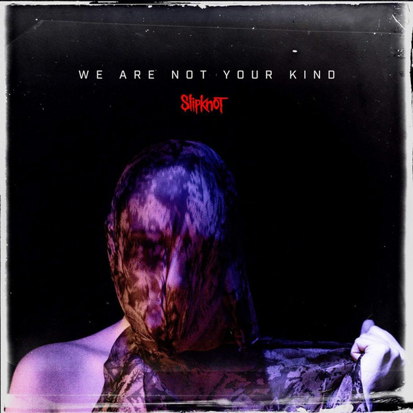

 

 

 

 

 
 
_lembre-se que esse contador de stats não contabiliza os repositórios privados!_  
 

 

    
kato8088's music :D

    

        
(i love) Foreground Eclipse

         
    
     
    <h3>Albums:</h3>
    
    
    
    
    
    
&

    
    

     
    

        
Slipknot

         
        <h3>Albums:</h3>
        <figure>
            
            <figcaption>#0 - Mate. Feed. Kill. Repeat. (1996)</figcaption>
        </figure> <figure>
            
            <figcaption>#1 - Slipknot (Self Titled) (1999)</figcaption>
        </figure> <figure>
            
            <figcaption>#2 - Iowa (2001)</figcaption>
        </figure> <figure>
            
            <figcaption>#3 - Vol. 3: (The Subliminal Verses) (2004)</figcaption>
        </figure> <figure>
            
            <figcaption>#4 - All Hope is Gone (2008)</figcaption>
        </figure> <figure>
            
            <figcaption>#5 - .5: The Gray Chapter (2014)</figcaption>
        </figure> <figure>
            
            <figcaption>#6 - We Are Not Your Kind (2019)</figcaption>
        </figure> <figure>
            
            <figcaption>#7 - The End So Far (2022)</figcaption>
        </figure>
        <h3>Singles:</h3>
        <figure>
            
            <figcaption>All Out Life (2018)</figcaption>
        </figure> <figure>
            
            <figcaption>Adderall (2023)</figcaption>
        </figure>
    

    

        
more coming soon!

        
    

<!--- many thanks to https://blinkies.cafe for keeping up their good work! ---!>